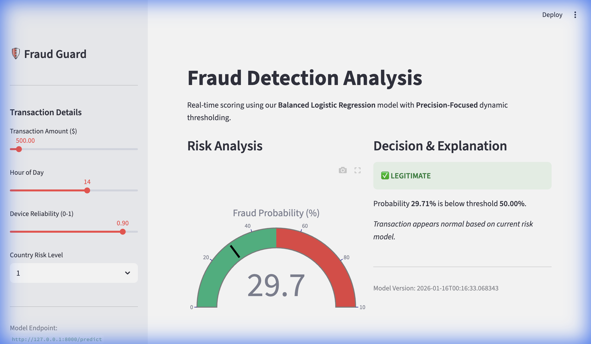
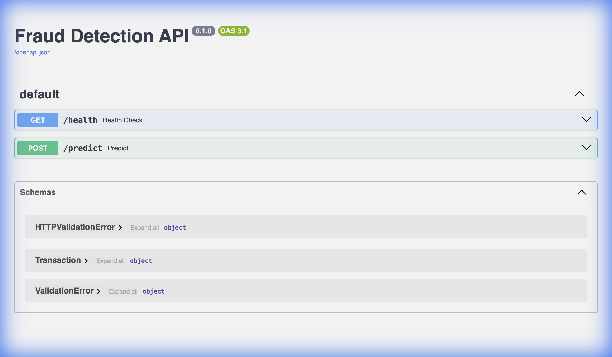

# Fraud Detection ML System

A production-ready Machine Learning system for fraud detection, built on a Mac M3 (Apple Silicon) environment. This project demonstrates an end-to-end pipeline including data ingestion, preprocessing, baseline model training, evaluation, and a FastAPI inference endpoint.

## Demo in 3 Minutes

1.  **Train the Model**:
    ```bash
    python src/fraudml/data/download.py && python src/fraudml/models/train.py
    ```

2.  **Start the System** (Run in two separate terminals):
    ```bash
    # Terminal 1: Backend API
    uvicorn src.fraudml.api.app:app --reload
    
    # Terminal 2: Frontend Dashboard
    streamlit run src/fraudml/ui/dashboard.py
    ```

3.  **Explore**:
    *   **Dashboard**: [http://localhost:8501](http://localhost:8501) - Interactive Risk Analysis.
    *   **API Docs**: [http://localhost:8000/docs](http://localhost:8000/docs) - Swagger UI.

### 📸 Screenshots

**Interactive Dashboard**


**API Documentation**


## Overview

Fraud detection is a classic imbalanced classification problem. This system finds fraudulent transactions using a Logistic Regression baseline optimized with balanced class weights.

**Key Features:**
- **Reproducible Pipeline:** Fixed seeds and versioned steps.
- **Metrics:** optimized for PR-AUC (Precision-Recall Area Under Curve), the gold standard for imbalanced datasets.
- **Dynamic Thresholding:** Automatically tunes decision boundary to meet 95% precision target.
- **Interactive UI:** Streamlit dashboard for real-time demos.
- **Production-Ready Structure:** Modular code, separation of concerns, and clear artifact management.

## Logic & Choices

- **Model**: Logistic Regression is chosen as a strong baseline. It is interpretable and fast.
- **Metric**: PR-AUC is used instead of ROC-AUC because of the heavy class imbalance (approx 1-2% fraud).
- **Threshold Tuning**:
    - Default decision threshold of 0.5 is often suboptimal for fraud.
    - We interpret the probability using a **tuned threshold** derived from the validation set.
    - **Goal**: Maintain a target precision of **0.95** (minimize false alarms) while maximizing recall.
    - The chosen threshold is saved in `artifacts/model_meta.json` and used automatically by the API.

- **Deployment**: FastAPI provides a high-performance, easy-to-document (Swagger UI at `/docs`) endpoint.

## Project Structure

```
fraud-ml-system/
├── artifacts/           # Trained models & metadata (gitignored)
├── data/                # Raw & processed data (gitignored)
├── reports/             # Generated plots & metrics
├── src/
│   └── fraudml/
│       ├── api/         # FastAPI serving application
│       ├── data/        # Data downloading & processing
│       └── models/      # Training & evaluation logic
├── tests/               # Pytest suite
├── requirements.txt
└── README.md
```

## Data Policy

This project uses a synthetic toy dataset by default to ensure privacy and compliance. **No real user data is included.** See `data/README.md` for instructions on using public datasets.
